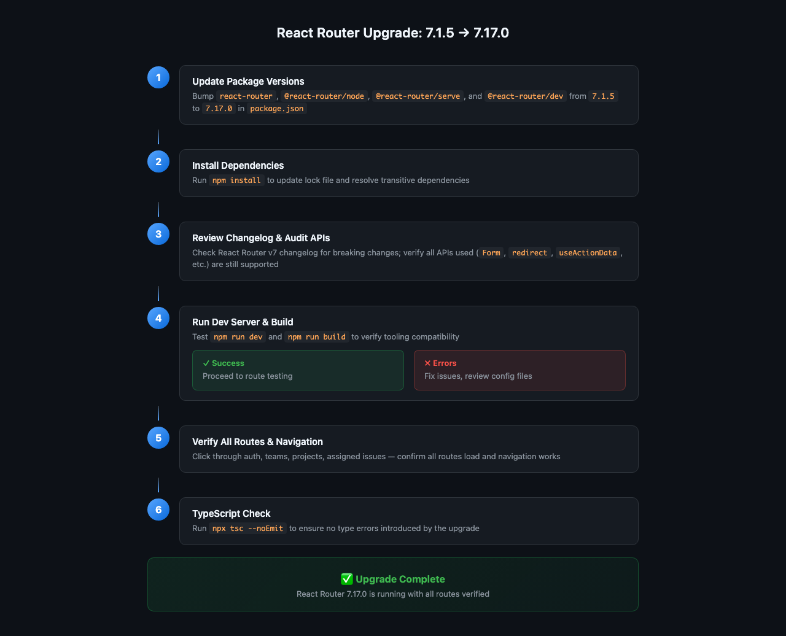

# Issue #1 – Upgrade React Router from 7.1.5 to 7.17.0

## Issue Summary

The project is currently running React Router v7.1.5. This plan outlines the upgrade to v7.17.0 (latest stable) to benefit from bug fixes, performance improvements, and new features released over the past several months.

## Current State

The `sqlsync-editor` application is already using React Router v7 with modern patterns:

- **Build tooling**: `@react-router/dev` for route generation and dev server
- **Server packages**: `@react-router/node` and `@react-router/serve` for SSR/prerendering
- **Route configuration**: Declarative route config via `@react-router/dev/routes` in `app/routes.ts`
- **App config**: `react-router.config.ts` with `ssr: false` (SPA mode)
- **Imports**: All imports use `react-router` (not `react-router-dom`)

### React Router APIs Used in the App

| API | Files Using It | Risk Level |
|-----|---------------|------------|
| `Link` | breadcrumbs, teams, projects | Low |
| `Navigate` | auth provider, document provider, projects, assigned | Low |
| `Outlet` | layouts (auth, assigned, projects, teams) | Low |
| `useLocation` | drawer, projects/id | Low |
| `useNavigate` | drawer, modal | Low |
| `useParams` | teams, assigned, issues, projects | Low |
| `useMatches` | breadcrumbs | Low |
| `useMatch` | sqlsync lib | Low |
| `Form` | routes (index, login, register, teams, projects, issues) | Low |
| `redirect` | routes (index, projects, assigned) | Low |
| `redirectDocument` | auth routes (login, register, logout) | Low |
| `useActionData` | login, register | Low |
| `useSubmit` | projects/new | Low |
| `useRouteLoaderData` | teams/id | Low |
| `ActionFunctionArgs` | multiple routes | Low |
| `ClientActionFunctionArgs` | teams/join | Low |
| `LinksFunction` | root.tsx | Low |
| `MetaFunction` | routes/index.tsx | Low |

### Package Versions to Update

| Package | Current | Target |
|---------|---------|--------|
| `react-router` | 7.1.5 | 7.17.0 |
| `@react-router/node` | 7.1.5 | 7.17.0 |
| `@react-router/serve` | 7.1.5 | 7.17.0 |
| `@react-router/dev` | 7.1.5 | 7.17.0 |

## Root Cause Analysis

This is a **dependency maintenance task**, not a bug. The current v7.1.5 is several months behind the latest release. React Router v7 has been actively developed with:

- **Bug fixes** for edge cases in routing, data loading, and form handling
- **Performance improvements** in client-side navigation and prefetching
- **New features** such as improved route middleware support and dev experience enhancements
- **Security patches** for any vulnerabilities discovered since January 2025

## Proposed Solution

### Upgrade Steps

1. **Update package.json versions** for all React Router packages
2. **Run `npm install`** to update lock files and transitive dependencies
3. **Review the changelog** for any breaking changes between 7.1.5 and 7.17.0
4. **Audit source code** for any deprecated APIs or changed behavior
5. **Run the dev server** (`npm run dev`) to verify the app starts correctly
6. **Run the production build** (`npm run build`) to verify SSR/prerender works
7. **Verify all routes** load correctly and navigation works as expected

### Files to Modify

- `package.json` — version bumps
- `package-lock.json` — regenerated by npm install

### New Files

None expected.

## Test Strategy

### Existing Tests

The project does not appear to have a test suite configured (no `test` script in package.json, no test files found). Testing will be manual:

1. **Dev server smoke test**: `npm run dev` → verify app loads at localhost
2. **Route navigation test**: Click through all major routes
3. **Form submission test**: Test login, registration, team creation, project creation
4. **Production build test**: `npm run build` → verify build succeeds without errors

### Regression Checklist

- [ ] App starts in dev mode without console errors
- [ ] All routes load correctly
- [ ] Navigation between routes works
- [ ] Forms submit correctly
- [ ] Authentication flow works (login/register/logout)
- [ ] Team and project CRUD operations work
- [ ] Production build succeeds
- [ ] No TypeScript errors (`npx tsc --noEmit`)

## Risks

| Risk | Likelihood | Impact | Mitigation |
|------|-----------|--------|------------|
| Breaking changes in React Router APIs | Low | Medium | Review changelog; all APIs used are core/stable |
| Transitive dependency conflicts | Low | Low | npm install will resolve; lock file ensures reproducibility |
| Build tooling changes | Low | Medium | Test `npm run dev` and `npm run build` |
| Coordinator submodule v6 transitive dep | Very Low | None | No source files import it; isolated from main app |

## Additional Context

The `coordinator/lib/sqlsync` submodule has `react-router@6.22.3` as a **transitive dependency** in its pnpm-lock.yaml. No source files in that directory directly import `react-router`. This does not block the main app upgrade.

## Diagram

