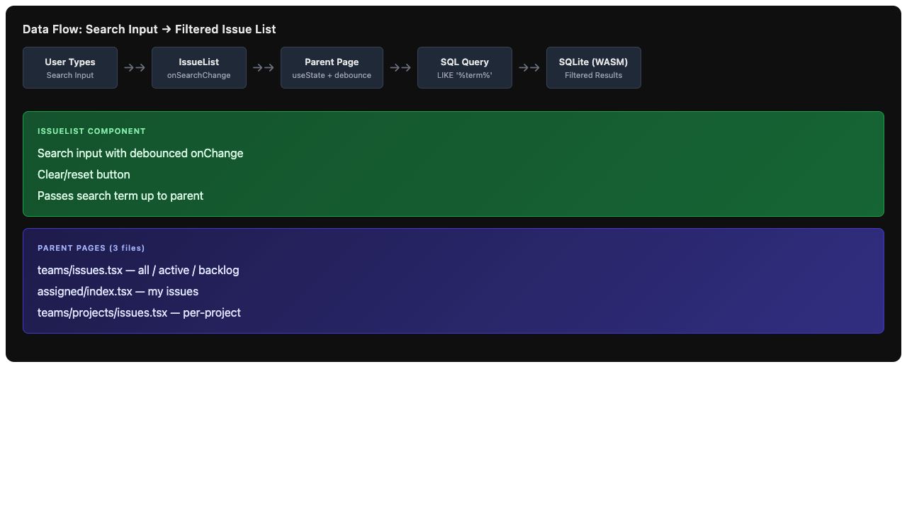

# Issue #2 – Add search input to filter issues by title and body

## Issue Summary

Add a search input to the issues list that filters issues by title and body using a SQLite `LIKE` query. This is a foundational UX feature — without it, users must manually scroll through potentially long issue lists to find what they need.

## Root Cause Analysis

This is a **missing feature**, not a bug. The app was built with list views for issues but never added any filtering or search capability. As issue volume grows, the current experience becomes unusable.

Key observations from codebase analysis:

- `IssueList` (`app/routes/issues/components/list.tsx`) is a reusable component used across **three** views:
  1. Team issues — all / active / backlog tabs
  2. Assigned issues — "My issues"
  3. Project issues — per-project filtered list
- Each parent page runs its own SQL query against the local SQLite document via `useDocumentQuery`.
- The `IssueList` component currently receives `issues`, `selected`, `setSelected`, and `toggleSelect` props.
- No search state or filtering logic exists anywhere in the app.

## Proposed Solution

### Architecture

Add search as a **cross-cutting concern** at the `IssueList` component level for the UI, and at each parent page's SQL query for the data filtering.



### Implementation Steps

#### 1. UI: Search Input in `IssueList`

Add a controlled search `<input>` to the `IssueList` header, styled to match the existing dark Tailwind UI:

- Positioned in the header row, right side (opposite the filter tabs on applicable views).
- Placeholder text: "Search issues..."
- Clear/reset button (× icon) appears when input has text.
- Debounced onChange — pass the search term up to parent after ~200ms of idle typing to avoid excessive re-queries.

The `IssueList` component will accept a new optional prop:

```tsx
interface Props {
  title: string;
  issues: Issue[];
  selected: string[];
  setSelected: React.Dispatch<React.SetStateAction<string[]>>;
  search?: string;
  onSearchChange?: (value: string) => void;
}
```

If `onSearchChange` is provided, render the search input. This keeps backward compatibility for views that don't need search (e.g., the recently-deleted view, if it were to reuse `IssueList` later).

#### 2. SQL Query Updates

Each parent page that uses `IssueList` with search will update its SQL query to include a conditional `LIKE` clause:

```sql
select *
from issues
where deleted_at is null
  and (?1 is null or (title like '%' || ?1 || '%' or body like '%' || ?1 || '%'))
  -- ... other existing filters
order by status_priority, created_at desc
```

The `?1 is null` guard ensures the query works correctly when no search term is provided.

**Affected pages:**

| Page | File | Current Query Param Count |
|------|------|--------------------------|
| Team issues (all) | `app/routes/teams/issues.tsx` | 2 (user_id, team_id) |
| Team issues (active) | `app/routes/teams/issues.tsx` | 2 (user_id, team_id) |
| Team issues (backlog) | `app/routes/teams/issues.tsx` | 2 (user_id, team_id) |
| Assigned | `app/routes/assigned/index.tsx` | 1 (user_id) |
| Project issues | `app/routes/teams/projects/issues.tsx` | 2 (team_id, project_id) |

Each page will:
1. Add `search` to local state (`useState<string>("")`).
2. Pass `search` as the next bind parameter in the query array.
3. Pass `search` and a setter to `IssueList`.

#### 3. Debouncing

Implement a simple debounce hook (or use a lightweight utility) to avoid firing a new SQL query on every keystroke:

```tsx
const [search, setSearch] = useState("");
const [debouncedSearch, setDebouncedSearch] = useState("");

useEffect(() => {
  const timer = setTimeout(() => setDebouncedSearch(search), 200);
  return () => clearTimeout(timer);
}, [search]);
```

Pass `debouncedSearch` to the SQL query, but `search` + `setSearch` to the `IssueList` component so the input feels responsive.

### Edge Cases & UX Considerations

| Scenario | Behavior |
|----------|----------|
| Empty search | Show all issues (LIKE guard handles this) |
| No results | Show empty state message: "No issues match your search" |
| Special chars in search | SQLite `LIKE` treats `%` and `_` as wildcards — acceptable for v1 |
| Case sensitivity | SQLite `LIKE` is case-insensitive by default in most builds — verify |
| Search + tab switching | Search persists across tab switches within the same view |
| Search + bulk select | Selected issues should remain selected even if filtered out (current behavior) |

## Files to Modify

- `app/routes/issues/components/list.tsx` — add search input UI
- `app/routes/teams/issues.tsx` — wire search into all three tab queries
- `app/routes/assigned/index.tsx` — wire search into assigned query
- `app/routes/teams/projects/issues.tsx` — wire search into project query

## New Files

None required.

## Test Strategy

1. **Unit tests** for the debounce utility (if extracted to a reusable hook).
2. **Integration test** via Playwright:
   - Type a search term that matches one issue title.
   - Assert only matching issues are visible.
   - Clear search.
   - Assert all issues reappear.
   - Search for text that only appears in issue body (not title).
   - Assert matching issue is visible.
3. **Regression test**:
   - Verify existing tab switching still works with search active.
   - Verify bulk selection still works with filtered results.

## Risks

| Risk | Mitigation |
|------|------------|
| SQL injection via search input | Use parameterized queries (`?` placeholders) — already the pattern |
| Performance with large datasets | `LIKE '%term%'` cannot use indexes. If performance degrades, upgrade to FTS5 |
| Debounce delay feels laggy | Tune to 150–250ms. Can make configurable later |
| Search state lost on navigation | Acceptable for v1. Could lift to URL query params in future |

## Alternatives Considered

- **Client-side filtering:** Simpler but loads all issues into memory. With SQLSync's local SQLite, a SQL query is the idiomatic approach.
- **FTS5 (Full-Text Search):** More powerful and faster for large datasets, but adds schema complexity. Defer until `LIKE` performance becomes a problem.
- **URL-based search params:** Nice-to-have for shareability. Out of scope for the initial implementation.
