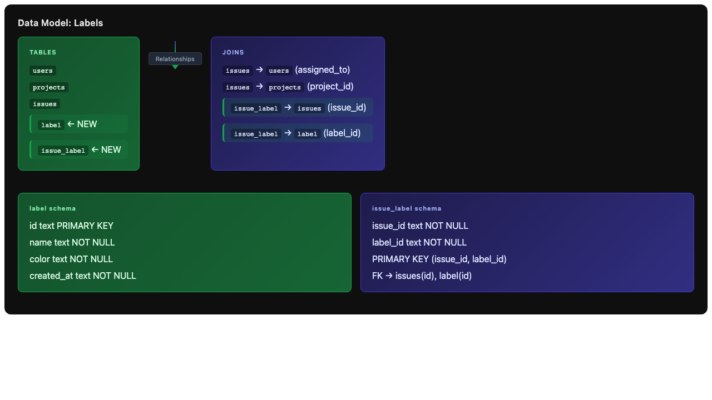
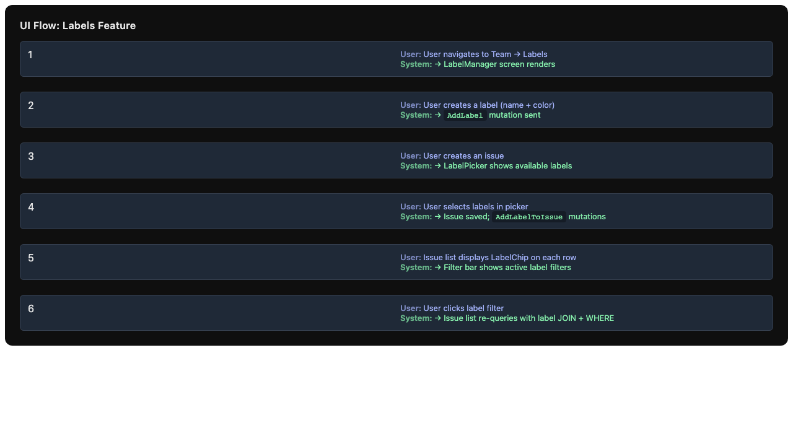
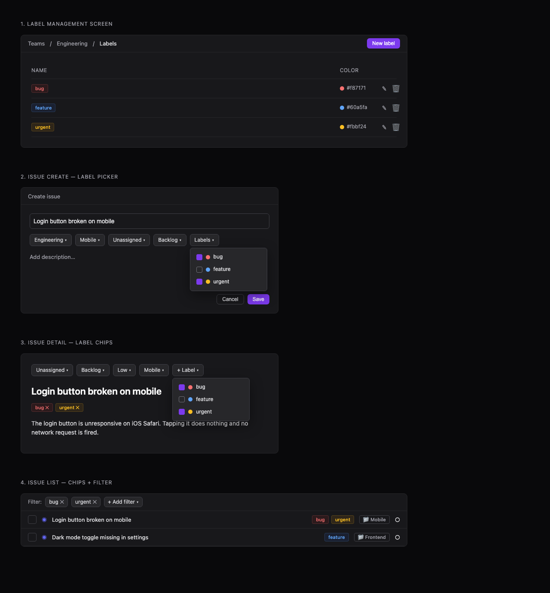

# Issue #3 – Add Issue Labels (Tags) with Team Management, Picker, and Filtering

## Issue Summary

Add **labels (tags)** to issues: a team can define a set of colored labels, apply multiple labels to any issue, see them as chips, and filter the issue list by label. A core issue-tracker capability (à la Linear/GitHub) that's currently missing.

**Motivation:** Teams need a lightweight way to categorize issues (`bug`, `feature`, `urgent`, `frontend`, …) beyond status/priority, to speed up triage and filtering.

## Root Cause Analysis

This is a **feature request**, not a bug. The current system lacks:
- No label data model (tables for `labels` and `issue_labels`)
- No mutations for label CRUD operations
- No UI components for label management, picking, or display
- No filtering capability by labels

## Proposed Solution

### Data Model

Add two new tables to the schema:

```sql
-- Label definition (scoped to team document / SQLSync journal)
CREATE TABLE IF NOT EXISTS labels (
    id TEXT PRIMARY KEY,
    name TEXT NOT NULL,
    color TEXT NOT NULL,
    created_at TEXT NOT NULL
);

-- Many-to-many relationship between issues and labels
CREATE TABLE IF NOT EXISTS issue_labels (
    issue_id TEXT NOT NULL,
    label_id TEXT NOT NULL,
    PRIMARY KEY (issue_id, label_id),
    FOREIGN KEY (issue_id) REFERENCES issues(id),
    FOREIGN KEY (label_id) REFERENCES labels(id)
);
```

Labels are scoped to a team because each team has its own SQLSync journal (`auth.organizations[].document`). No `team_id` column is required.

### Mutations (Rust + TypeScript)

**Rust (`reducer/src/lib.rs`):**
```rust
enum Mutation {
    // ... existing mutations ...

    // Label management
    AddLabel { id: String, name: String, color: String },
    RemoveLabel { id: String },  // Also deletes issue_label rows

    // Label assignment
    AddIssueLabel { issue_id: String, label_id: String },
    RemoveIssueLabel { issue_id: String, label_id: String },
}
```

**TypeScript (`app/doctype.ts`):**
```typescript
type Mutation =
  // ... existing mutations ...
  | { tag: "AddLabel"; id: string; name: string; color: string }
  | { tag: "RemoveLabel"; id: string }
  | { tag: "AddIssueLabel"; issue_id: string; label_id: string }
  | { tag: "RemoveIssueLabel"; issue_id: string; label_id: string };

type Label = {
  id: string;
  name: string;
  color: string;
  created_at: string;
};
```

### UI Components

1. **Label Management Screen** (`app/routes/teams/labels/index.tsx`)
   - List all labels for the team
   - Create new label (name + color picker)
   - Edit existing label (rename, recolor)
   - Delete label (with confirmation)

2. **Label Picker Component** (`app/routes/issues/components/label-picker.tsx`)
   - Multi-select chip-based picker
   - Shows available labels with colored chips
   - Used in issue create and issue detail views
   - The base `Select` component is single-select only, so the picker will be a custom popover with checkbox items.

3. **Label Chip Component** (`app/routes/issues/components/label-chip.tsx`)
   - Inline colored pill showing label name
   - Optional remove button
   - Appears on issue list rows and issue detail view

4. **Label Filter** (`app/routes/issues/components/label-filter.tsx`)
   - Filter issue list by one or more selected labels
   - Multi-select with label chips

## Files to Modify

### Backend (Rust WASM Reducer)
- `reducer/src/lib.rs` - Add label mutations and schema

### TypeScript Types
- `app/doctype.ts` - Add `Label` type and mutation variants

### New UI Components
- `app/routes/issues/components/label-picker.tsx` - Multi-select for labels
- `app/routes/issues/components/label-chip.tsx` - Colored label display
- `app/routes/issues/components/label-filter.tsx` - Filter by labels
- `app/routes/teams/labels/index.tsx` - Label management screen
- `app/routes/teams/labels/new.tsx` - Create label modal

### Modified UI Components
- `app/routes/issues/components/create.tsx` - Add label picker to create form
- `app/routes/issues/components/details.tsx` - Add label management to issue details
- `app/routes/issues/components/list.tsx` - Show label chips on rows, add filter
- `app/routes/issues/id.tsx` - Load labels for issue detail
- `app/routes/teams/issues.tsx` - Query labels and pass to list + filter

### Tests
- `reducer/src/lib.rs` - Reducer unit tests for label mutations
- `tests/label-components.test.tsx` - New component tests for label picker/chip/filter

## Test Strategy

### Unit Tests
1. **Reducer tests** (`reducer/src/lib.rs`):
   - `InitSchema` creates `labels` and `issue_labels` tables
   - `AddLabel`, `RemoveLabel`, `AddIssueLabel`, `RemoveIssueLabel` mutations succeed and generate correct SQL
   - `RemoveLabel` cascade-deletes from `issue_labels`

2. **Component tests** (`tests/label-components.test.tsx`):
   - Label picker multi-select behavior
   - Label chip rendering with correct colors
   - Filter applies correct label IDs
   - Follow existing pattern: `vi.mock("~/context/document.context")`, bare `render()`, `fireEvent`

### Integration / Manual Testing Checklist
- [ ] Create/rename/recolor/delete labels in management screen
- [ ] Add/remove multiple labels on issue create
- [ ] Add/remove labels from issue detail view
- [ ] Label chips show on issue detail and list rows
- [ ] Filter issue list by one or more labels
- [ ] Deleting a label removes it from all issues
- [ ] Labels sync across clients (two tabs)
- [ ] Labels are isolated per team

## Risks

1. **Schema migration**: The system uses `create table if not exists` - adding tables is safe, but existing documents won't have label data until `InitSchema` runs again. For dev/demo purposes this is acceptable.

2. **Cascade deletes**: SQLite doesn't enforce FK cascade by default. The `RemoveLabel` mutation must explicitly delete from `issue_labels` table.

3. **Performance**: Filtering by multiple labels requires JOINs. For large datasets, may need indexing on `issue_labels(issue_id, label_id)`.

4. **Color accessibility**: Users may pick low-contrast colors. Consider enforcing minimum contrast ratios or providing preset accessible color palettes.

5. **Sync conflicts**: Two users editing the same label simultaneously could cause conflicts. SQLSync's CRDT approach should handle this, but edge cases may exist.

## Architecture Diagram



## UI Flow



## UI Mockup



## Implementation Sequence

1. **Phase 1: Schema + Mutations** (Backend)
   - Add `labels` and `issue_labels` tables to `InitSchema`
   - Implement label CRUD mutations in Rust
   - Add TypeScript types in `doctype.ts`

2. **Phase 2: Label Management UI** (Team Settings)
   - Create label management route and screen
   - Label list with edit/delete
   - Create new label modal with color picker

3. **Phase 3: Label Picker + Chips** (Components)
   - Create reusable `LabelChip` component
   - Create custom `LabelPicker` multi-select component

4. **Phase 4: Integration** (Issue Create/Detail)
   - Add label picker to issue create form
   - Add label management to issue detail view
   - Show label chips on issue detail

5. **Phase 5: List + Filter** (Issue List)
   - Show label chips on issue list rows
   - Add label filter component
   - Implement SQL filtering by labels

6. **Phase 6: Testing + Polish**
   - Write unit/integration tests
   - Test sync across clients
   - Accessibility review (color contrast)
   - Performance optimization (indexes if needed)

## Acceptance Criteria

- [ ] Create / rename / recolor / delete a label
- [ ] Add/remove multiple labels on an issue (at create time and from the detail view)
- [ ] Label chips show on the issue detail and on each issue-list row
- [ ] The issue list can be filtered by one or more labels
- [ ] Deleting a label removes it from all issues (`issue_labels` rows cleaned up)
- [ ] Labels and assignments sync across clients (two tabs; changes propagate)
- [ ] Labels are isolated per team

## Out of Scope

- Label-based automation / saved views
- Cross-team / global labels
- Bulk label editing from list multi-select
