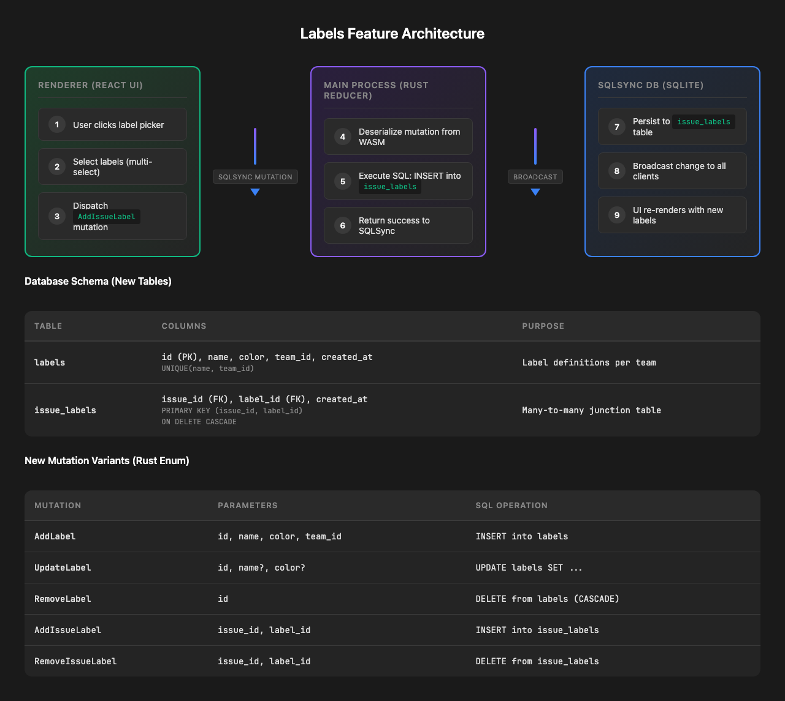
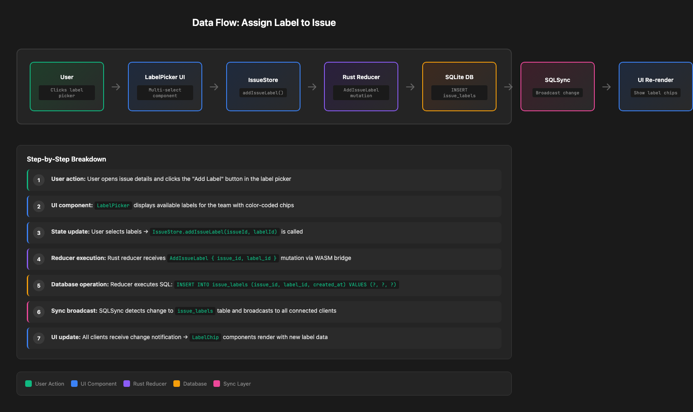
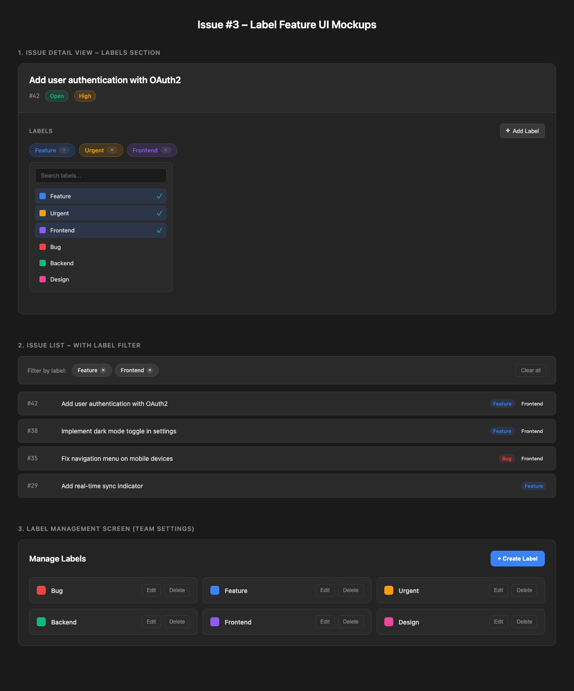

# Issue #3 – Add Issue Labels (Tags) with Team Management, Picker, and Filtering

## Issue Summary

Add **labels (tags)** to issues: a team can define a set of colored labels, apply multiple labels to any issue, see them as chips, and filter the issue list by label. A core issue-tracker capability (à la Linear/GitHub) that's currently missing.

### Motivation

Teams need a lightweight way to categorize issues (`bug`, `feature`, `urgent`, `frontend`, …) beyond status/priority, to speed up triage and filtering.

### Scope / Requirements

- **Define labels per team** — create, rename, recolor, delete in a management screen
- **Apply labels to issues** — assign/unassign multiple labels on issue create and on the detail view
- **See labels** — chips on the issue detail and on each issue-list row
- **Filter** — narrow the issue list by one or more selected labels
- Labels are scoped to a team (they live in that team's SQLSync document)

## Root Cause Analysis

This is a **feature request**, not a bug fix. The current schema and UI lack:

## Diagrams

### Architecture Overview



### Data Flow: Label Assignment



### UI Mockups



## Proposed Solution

1. **No labels table** — The database schema has `users`, `projects`, `issues`, `comments`, and `activities` tables, but no `labels` or `issue_labels` tables
2. **No Mutation variants** — The Rust reducer's `Mutation` enum has no label-related operations
3. **No UI components** — No label picker, label chips, or label management interface
4. **No filtering** — The issue list cannot be filtered by labels

## Proposed Solution

### Database Schema Changes

Add two new tables to the SQLSync schema:

```sql
-- Labels table: stores label definitions per team
create table if not exists labels (
    id text primary key,
    name text not null,
    color text not null,  -- hex color like "#FF5733"
    team_id text not null,
    created_at text not null,
    unique(name, team_id)  -- prevent duplicate label names within a team
);

-- Junction table: many-to-many relationship between issues and labels
create table if not exists issue_labels (
    issue_id text not null,
    label_id text not null,
    created_at text not null,
    primary key (issue_id, label_id),
    foreign key (issue_id) references issues(id) on delete cascade,
    foreign key (label_id) references labels(id) on delete cascade
);
```

### Reducer Mutations (Rust → WASM)

Add new `Mutation` enum variants in `reducer/src/lib.rs`:

```rust
enum Mutation {
    // ... existing variants ...
    
    // Label management
    AddLabel {
        id: String,
        name: String,
        color: String,
        team_id: String,
    },
    UpdateLabel {
        id: String,
        name: Option<String>,
        color: Option<String>,
    },
    RemoveLabel {
        id: String,
    },
    
    // Issue-label assignments
    AddIssueLabel {
        issue_id: String,
        label_id: String,
    },
    RemoveIssueLabel {
        issue_id: String,
        label_id: String,
    },
}
```

### Frontend Components

#### 1. Label Management Screen
- **Location**: `app/routes/teams/settings/labels.tsx` (new file)
- **Features**:
  - List all labels for the current team
  - Create new label (name + color picker)
  - Edit existing label (rename, recolor)
  - Delete label (cascades to remove from all issues)

#### 2. Label Picker Component
- **Location**: `app/routes/issues/components/label-picker.tsx` (new file)
- **Usage**: Embedded in create issue form and issue details view
- **Features**:
  - Multi-select dropdown
  - Shows label chips with colors
  - Search/filter labels by name
  - Create new label inline (optional)

#### 3. Label Chips Display
- **Location**: Update `app/routes/issues/components/issue.tsx` and `list.tsx`
- **Features**:
  - Render label chips with background color matching label definition
  - Truncate with "+N" if too many labels
  - Click to remove label (in detail view)

#### 4. Label Filter
- **Location**: Update `app/routes/issues/components/list.tsx`
- **Features**:
  - Filter bar with label multi-select
  - Show active label filters as chips
  - Clear all filters button

### Files to Modify

| File | Changes |
|------|---------|
| `reducer/src/lib.rs` | Add `labels` and `issue_labels` tables to `InitSchema`; add 5 new Mutation variants with handlers |
| `app/routes/issues/components/create.tsx` | Add label picker to the create form |
| `app/routes/issues/components/details.tsx` | Add label picker section for editing labels on existing issue |
| `app/routes/issues/components/list.tsx` | Add label filter bar; show label chips on each issue row |
| `app/routes/issues/components/issue.tsx` | Show label chips in issue detail view |

### New Files

| File | Purpose |
|------|---------|
| `app/routes/issues/components/label-picker.tsx` | Reusable multi-select label picker component |
| `app/routes/teams/settings/labels.tsx` | Label management screen (CRUD for labels) |
| `app/components/shared/label-chip.tsx` | Reusable label chip UI component |
| `tests/labels.test.tsx` | Unit tests for label functionality |
| `tests/issue-labels.test.tsx` | Integration tests for issue-label assignments |

## Test Strategy

### Unit Tests

1. **Label picker component**:
   - Renders available labels with correct colors
   - Allows multi-select
   - Shows selected labels as chips
   - Remove button works

2. **Label chip component**:
   - Displays label name and color correctly
   - Truncates long names
   - Remove button appears when clickable

3. **Label management screen**:
   - Create label validates name/color
   - Edit label updates correctly
   - Delete label removes from all issues

### Integration Tests

1. **Create issue with labels**:
   - Select labels during creation
   - Verify labels appear on issue after save

2. **Edit issue labels**:
   - Add labels to existing issue
   - Remove labels from existing issue
   - Verify changes persist

3. **Filter issues by label**:
   - Apply label filter
   - Verify only matching issues shown
   - Clear filter shows all issues

4. **Label deletion cascade**:
   - Delete a label
   - Verify removed from all issues
   - Verify label no longer in picker

### Edge Cases

- Empty label name validation
- Duplicate label name prevention (per team)
- Maximum labels per issue (if any)
- Color validation (hex format)
- Concurrent label modifications (sync across clients)

## Risks

| Risk | Mitigation |
|------|------------|
| **Schema migration** — Existing teams need new tables | `InitSchema` uses `create table if not exists`, safe to run on existing databases |
| **Sync conflicts** — Multiple clients modifying labels | SQLSync handles conflict resolution; junction table design avoids write conflicts |
| **Performance** — Many labels per issue could slow queries | Add indexes on `issue_labels(issue_id, label_id)`; limit display to first N labels with "+X more" |
| **Color accessibility** — Poor contrast with text | Use white text on dark colors, black text on light colors (calculate luminance) |
| **Cross-team isolation** — Labels must not leak between teams | All queries include `team_id` filter; foreign keys enforce referential integrity |

## Implementation Plan

### Phase 1: Backend Foundation
1. Add schema tables to `InitSchema` mutation
2. Add 5 new Mutation variants to Rust reducer
3. Implement reducer handlers for each mutation
4. Write unit tests for reducer logic

### Phase 2: Core UI Components
1. Create `LabelChip` component
2. Create `LabelPicker` component
3. Integrate picker into issue create form
4. Integrate picker into issue details view

### Phase 3: Label Management
1. Create label management screen
2. Implement CRUD operations
3. Add color picker UI
4. Handle delete cascade

### Phase 4: Filtering & Display
1. Add label chips to issue list rows
2. Add label filter bar to issue list
3. Add label chips to issue detail view
4. Implement filter state management

### Phase 5: Testing & Polish
1. Write comprehensive unit tests
2. Write integration tests
3. Test sync across multiple clients
4. Polish UI (animations, error states, loading states)

## Acceptance Criteria

- [ ] Create / rename / recolor / delete a label
- [ ] Add/remove multiple labels on an issue (at create time and from the detail view)
- [ ] Label chips show on the issue detail and on each issue-list row
- [ ] The issue list can be filtered by one or more labels
- [ ] Deleting a label removes it from all issues (`issue_labels` rows cleaned up)
- [ ] Labels and assignments sync across clients (two tabs; changes propagate)
- [ ] Labels are isolated per team

## Out of Scope

- Label-based automation / saved views
- Cross-team / global labels
- Bulk label editing from list multi-select

## Diagrams

### Data Flow: Label Creation and Assignment

```
┌─────────────┐     ┌──────────────┐     ┌─────────────┐     ┌──────────────┐
│   User UI   │────▶│  LabelPicker │────▶│  Reducer    │────▶│  SQLSync DB  │
│             │     │  Component   │     │  (Rust/WASM)│     │              │
└─────────────┘     └──────────────┘     └─────────────┘     └──────────────┘
       │                    │                    │                    │
       │ 1. Click "Add Label"                    │                    │
       │                    │                    │                    │
       │                    │ 2. Dispatch mutation                    │
       │                    │    AddIssueLabel {                      │
       │                    │      issue_id, label_id }               │
       │                    │                    │                    │
       │                    │                    │ 3. INSERT into     │
       │                    │                    │    issue_labels    │
       │                    │                    │                    │
       │                    │ 4. Broadcast change◀───────────────────│
       │                    │    (SQLSync sync)  │                    │
       │ 5. Re-render       │◀───────────────────│                    │
       │    label chips     │                    │                    │
       │◀───────────────────│                    │                    │
```

### State Machine: Label Management

```
┌──────────┐     create      ┌──────────┐     edit       ┌──────────┐
│   No     │────────────────▶│  Label   │───────────────▶│  Label   │
│  Labels  │                 │  Exists  │                │  Updated │
└──────────┘                 └──────────┘                └──────────┘
                                  │                          │
                                  │ delete                   │ delete
                                  ▼                          ▼
                            ┌──────────┐              ┌──────────┐
                            │  Label   │              │  Label   │
                            │ Deleted  │◀─────────────│ Removed  │
                            └──────────┘              └──────────┘
```

## Technical Notes

### Color Storage

Store colors as hex strings (`#RRGGBB`) for:
- Simple serialization
- Direct use in CSS `background-color`
- Easy color picker integration

### Label Ordering

Labels should be displayed in:
1. Creation order (default)
2. Or alphabetically by name (optional)

Use `created_at` timestamp for ordering.

### Cascade Delete

When a label is deleted:
1. Remove from `labels` table
2. SQLite `ON DELETE CASCADE` removes all `issue_labels` rows
3. UI updates automatically via SQLSync subscription

### Sync Strategy

SQLSync handles all sync automatically:
- Mutations are serialized and broadcast
- Conflicts resolved by last-write-wins (or custom logic if needed)
- All clients see consistent state eventually
