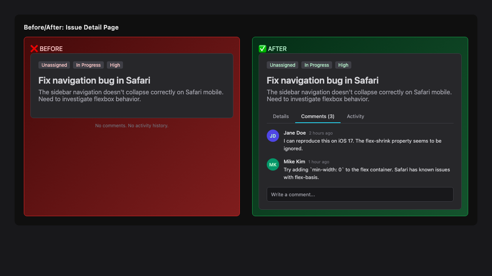

# Issue #4 – Issue Comments & Activity Feed

## Issue Summary

Add the ability to comment on issues and see an activity timeline of changes. This feature spans the Rust WASM reducer and the React frontend, consisting of **6 tasks** with clear dependencies.

**Dependency graph:**
- Tasks 1 & 2 can run in parallel (both Rust reducer changes)
- Tasks 3 & 4 can run in parallel once 1 & 2 are done (both React UI components)
- Task 5 depends on 3 & 4 (integration)
- Task 6 depends on 1 & 2 (type updates)

## Architecture


## Data Flow


## UI Before/After



## Task Breakdown

### Task 1: Comment Schema & Mutations (`reducer/src/lib.rs`)

**Schema:**
```sql
CREATE TABLE IF NOT EXISTS comments (
    id TEXT PRIMARY KEY,
    issue_id TEXT NOT NULL,
    author_id TEXT NOT NULL,
    body TEXT NOT NULL,
    created_at TEXT NOT NULL,
    updated_at TEXT NOT NULL,
    FOREIGN KEY (issue_id) REFERENCES issues(id),
    FOREIGN KEY (author_id) REFERENCES users(id)
)
```

**Mutations:**
- `AddComment { id, issue_id, author_id, body }`
- `EditComment { id, body }`
- `DeleteComment { id }`

### Task 2: Activity Log Schema & Mutations (`reducer/src/lib.rs`)

**Schema:**
```sql
CREATE TABLE IF NOT EXISTS activities (
    id TEXT PRIMARY KEY,
    issue_id TEXT NOT NULL,
    actor_id TEXT NOT NULL,
    action TEXT NOT NULL,
    payload TEXT,
    created_at TEXT NOT NULL,
    FOREIGN KEY (issue_id) REFERENCES issues(id)
)
```

**Mutations:**
- `LogActivity { id, issue_id, actor_id, action, payload }`

**Auto-logging:** Hook into `UpdateIssue`, `AssignIssue`, and `MoveIssues` mutations to automatically insert activity rows when issues change.

### Task 3: Comment UI Components (`app/routes/issues/components/comments/`)

Create three new components:
- **`CommentList.tsx`** — Scrollable list of comments for an issue, queries `comments` table via SQLSync
- **`CommentInput.tsx`** — Textarea + submit button for new comments, uses `useMutate` for `AddComment`
- **`CommentItem.tsx`** — Single comment with author avatar, timestamp, edit/delete actions. Inline editing support.

All styled with existing Tailwind dark theme classes.

### Task 4: Activity Feed UI Component (`app/routes/issues/components/activity/`)

Create:
- **`ActivityFeed.tsx`** — Chronological list of activity events with icons for different action types (status change, assignment, move, comment). Queries `activities` table via SQLSync.

### Task 5: Integration (`app/routes/issues/components/issue.tsx`)

- Add tab navigation (Details | Comments | Activity) below the issue body
- Render `CommentList` + `CommentInput` in Comments tab
- Render `ActivityFeed` in Activity tab
- Pass `issue_id` to all child components

### Task 6: TypeScript Types (`app/doctype.ts`)

Extend the `Mutation` union:
- `AddComment`, `EditComment`, `DeleteComment`
- `LogActivity`

Add new types:
```typescript
export type Comment = {
  id: string;
  issue_id: string;
  author_id: string;
  body: string;
  created_at: string;
  updated_at: string;
};

export type Activity = {
  id: string;
  issue_id: string;
  actor_id: string;
  action: string;
  payload: string | null;
  created_at: string;
};
```

## Files to Modify

| File | Change |
|------|--------|
| `reducer/src/lib.rs` | Add comments/activities tables, mutations, auto-logging hooks |
| `app/doctype.ts` | Add new mutation variants and type exports |
| `app/routes/issues/components/issue.tsx` | Add tabs, integrate comment + activity components |
| `app/routes/issues/id.tsx` | Query for `project_id` to pass to issue component |

## New Files

| File | Purpose |
|------|---------|
| `app/routes/issues/components/comments/CommentList.tsx` | List comments for an issue |
| `app/routes/issues/components/comments/CommentInput.tsx` | Input for new comments |
| `app/routes/issues/components/comments/CommentItem.tsx` | Single comment display + actions |
| `app/routes/issues/components/activity/ActivityFeed.tsx` | Activity timeline |
| `app/lib/string.ts` | Date formatting utilities (relative time) |

## Test Strategy

This project has **no existing test infrastructure**. We will add:

1. **Vitest** for frontend unit/component testing
2. Tests for:
   - `CommentItem` rendering and edit/delete actions
   - `CommentInput` submit validation
   - `ActivityFeed` chronological sorting
   - Date formatting utilities
3. **Reducer build verification** — `cargo build` must succeed for WASM target

## Risks

| Risk | Mitigation |
|------|------------|
| SQLSync WASM reducer compilation failures | Verify `npm run build:reducer` after every Rust change |
| Schema migration on existing documents | `InitSchema` is idempotent; new tables use `IF NOT EXISTS` |
| Real-time sync of comments across clients | SQLSync handles this automatically via CRDT replication |
| UI tab state persistence | Use React `useState` for active tab; no persistence needed |
| Activity auto-logging creates duplicate entries | Use single INSERT per mutation handler |
