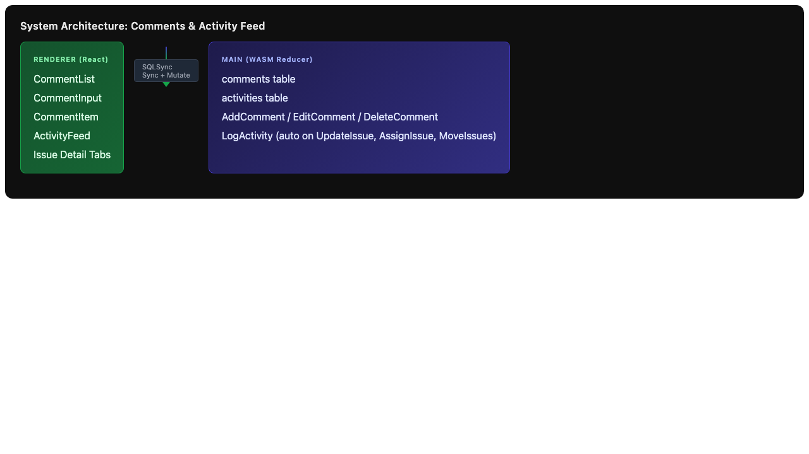
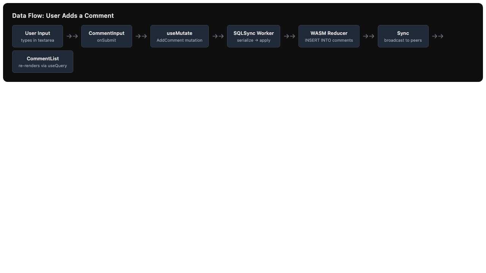
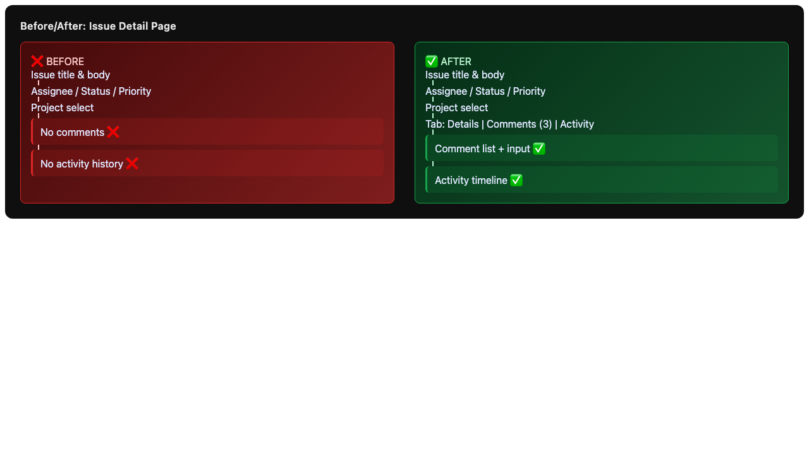

# Issue #4 – Issue Comments & Activity Feed

## Issue Summary

Add the ability to comment on issues and see an activity timeline of changes. This feature spans both the Rust WASM reducer and the React frontend, touching the database schema, mutations, UI components, and type definitions.

## Architecture Overview

The implementation consists of **6 sequential tasks** with the following dependency graph:

- **Tasks 1 & 2** (Rust reducer) → can run in parallel
- **Tasks 3 & 4** (React UI) → depend on 1 & 2
- **Task 5** (Integration) → depends on 3 & 4
- **Task 6** (Type updates) → depends on 1 & 2

```
┌─────────────┐     ┌─────────────┐
│ Task 1:     │     │ Task 2:     │
│ Comment     │     │ Activity    │
│ Schema      │     │ Log Schema  │
└──────┬──────┘     └──────┬──────┘
       │                   │
       └─────────┬─────────┘
                 ▼
       ┌───────────────────┐
       │ Task 6: Types     │
       └───────────────────┘
                 │
       ┌─────────┴─────────┐
       ▼                   ▼
┌─────────────┐     ┌─────────────┐
│ Task 3:     │     │ Task 4:     │
│ Comment UI  │     │ Activity UI │
└──────┬──────┘     └──────┬──────┘
       │                   │
       └─────────┬─────────┘
                 ▼
       ┌───────────────────┐
       │ Task 5: Integrate │
       │ into Issue Page   │
       └───────────────────┘
```

## Root Cause Analysis

This is a **feature request**, not a bug. The system currently supports:
- Users, projects, and issues with CRUD operations
- Issue assignment, status updates, priority changes, archiving, and moving between projects

What is **missing**:
- No way to attach human-readable discussion to issues
- No audit trail of who changed what and when
- Users cannot collaborate asynchronously on issue resolution

## Proposed Solution

### Task 1: Comment Schema & Mutations (`reducer/src/lib.rs`)

Add a `comments` table in `InitSchema`:
```sql
CREATE TABLE IF NOT EXISTS comments (
    id TEXT PRIMARY KEY,
    issue_id TEXT NOT NULL,
    author_id TEXT NOT NULL,
    body TEXT NOT NULL,
    created_at TEXT NOT NULL,
    updated_at TEXT NOT NULL,
    FOREIGN KEY (issue_id) REFERENCES issues(id),
    FOREIGN KEY (author_id) REFERENCES users(id)
)
```

Add mutation variants:
- `AddComment { id, issue_id, author_id, body }`
- `EditComment { id, body }`
- `DeleteComment { id }`

Each mutation performs the appropriate SQL `INSERT`, `UPDATE`, or `DELETE`.

### Task 2: Activity Log Schema & Mutations (`reducer/src/lib.rs`)

Add an `activities` table in `InitSchema`:
```sql
CREATE TABLE IF NOT EXISTS activities (
    id TEXT PRIMARY KEY,
    issue_id TEXT NOT NULL,
    actor_id TEXT NOT NULL,
    action TEXT NOT NULL,
    payload TEXT,
    created_at TEXT NOT NULL,
    FOREIGN KEY (issue_id) REFERENCES issues(id)
)
```

Add mutation variant:
- `LogActivity { id, issue_id, actor_id, action, payload }`

Hook into existing mutations (`UpdateIssue`, `AssignIssue`, `MoveIssues`) to auto-insert activity rows after the primary mutation succeeds. The `payload` stores the previous/new values as JSON (e.g., `{"from":"backlog","to":"inprogress"}`).

### Task 3: Comment UI Components (`app/components/comment-list/`, `comment-input/`, `comment-item/`)

Create three components following the existing component pattern (`index.tsx` + co-located styles via Tailwind):

- **`CommentList`** — queries `comments` for an `issue_id`, renders a scrollable list
- **`CommentInput`** — controlled textarea with submit button, calls `useMutate` with `AddComment`
- **`CommentItem`** — displays author (via `UserIcon`), timestamp, body text, and edit/delete actions

Style with existing Tailwind dark theme (`bg-zinc-950`, `text-zinc-300`, `border-zinc-800`).

### Task 4: Activity Feed Component (`app/components/activity-feed/`)

Create **`ActivityFeed`** — queries `activities` for an `issue_id`, renders a chronological timeline.

Render different `action` types with friendly text:
- `"status"` → "Alice changed status from Backlog → In Progress"
- `"assign"` → "Bob assigned to Charlie"
- `"move"` → "Alice moved to Project X"

Group by date (Today, Yesterday, etc.) using `app/lib/date.ts` utilities.

### Task 5: Integrate into Issue Detail Page

Update **`app/routes/issues/id.tsx`** and **`app/routes/issues/components/issue.tsx`**:
- Add a tab switcher: **Details** | **Comments (N)** | **Activity**
- Pass `issue_id` through props to comment/activity components
- Preserve existing layout and styling

### Task 6: TypeScript Types (`app/doctype.ts`)

Add to the `Mutation` discriminated union:
- `AddComment`, `EditComment`, `DeleteComment`
- `LogActivity`

Add types:
```typescript
export type Comment = {
  id: string;
  issue_id: string;
  author_id: string;
  body: string;
  created_at: string;
  updated_at: string;
};

export type Activity = {
  id: string;
  issue_id: string;
  actor_id: string;
  action: string;
  payload: string | null;
  created_at: string;
};
```

## Files to Modify

| File | Task | Change |
|------|------|--------|
| `reducer/src/lib.rs` | 1, 2 | Add `comments` and `activities` tables to `InitSchema`; add 4 new `Mutation` variants; auto-log activities on `UpdateIssue`, `AssignIssue`, `MoveIssues` |
| `app/doctype.ts` | 6 | Extend `Mutation` union; add `Comment` and `Activity` types |
| `app/routes/issues/components/issue.tsx` | 5 | Add tabs for Comments/Activity; pass `issue_id` to child components |
| `app/routes/issues/id.tsx` | 5 | No direct changes needed if `issue.tsx` receives `issue_id` |

## New Files

| File | Task | Description |
|------|------|-------------|
| `app/components/comment-list/index.tsx` | 3 | Comment list container |
| `app/components/comment-input/index.tsx` | 3 | New comment textarea + submit |
| `app/components/comment-item/index.tsx` | 3 | Single comment display with edit/delete |
| `app/components/activity-feed/index.tsx` | 4 | Chronological activity timeline |
| `app/lib/date.ts` | 3, 4 | Date formatting utilities (relative time, grouping) |
| `tests/comment-components.test.tsx` | 3 | Tests for comment UI |
| `tests/activity-feed.test.tsx` | 4 | Tests for activity feed |
| `tests/reducer-schema.test.ts` | 1, 2 | Tests for reducer schema changes |
| `tests/issue-integration.test.tsx` | 5 | Integration tests for issue page tabs |
| `vitest.config.ts` | — | Vitest configuration |
| `reducer/.cargo/config.toml` | 1, 2 | Cargo config for WASM target |

## Test Strategy

1. **Reducer schema tests** (`tests/reducer-schema.test.ts`):
   - Verify `InitSchema` creates `comments` and `activities` tables
   - Verify `AddComment` / `EditComment` / `DeleteComment` mutations work
   - Verify activity auto-logging on `UpdateIssue`, `AssignIssue`, `MoveIssues`

2. **Comment component tests** (`tests/comment-components.test.tsx`):
   - `CommentList` renders comments sorted by `created_at`
   - `CommentInput` calls `mutate` with correct payload on submit
   - `CommentItem` shows edit/delete buttons; edit mode toggles textarea

3. **Activity feed tests** (`tests/activity-feed.test.tsx`):
   - Renders activities sorted chronologically
   - Groups by date (Today, Yesterday)
   - Correctly maps action types to friendly text

4. **Integration tests** (`tests/issue-integration.test.tsx`):
   - Tab switching works between Details/Comments/Activity
   - Comment count shows in tab label
   - Adding a comment updates the list and tab count

5. **Date utility tests**:
   - `formatRelativeTime` — "2h ago", "yesterday", date fallback
   - `groupByDate` — groups items by "Today", "Yesterday", "MMM D"

## Risks

| Risk | Mitigation |
|------|-----------|
| **Reducer compilation fails** (WASM target) | Add `.cargo/config.toml` with `target = "wasm32-unknown-unknown"`; ensure `wasm32-unknown-unknown` target is installed |
| **Missing test infrastructure** | Add `vitest` + `@testing-library/react` + `jsdom`; configure `vitest.config.ts` with React/Vite support |
| **Activity logging fails silently** | Log errors with `log::error!` if activity insert fails; don't block primary mutation |
| **Date formatting timezone issues** | Use `Intl.DateTimeFormat` with explicit `timeZone: 'UTC'` in tests; use `toLocaleDateString` with consistent locale |
| **Schema migration on existing docs** | `InitSchema` is idempotent (`CREATE TABLE IF NOT EXISTS`); existing docs will create tables on next `InitSchema` call. However, the app currently calls `InitSchema` once at startup via `DocumentProvider`, so new tables will be created automatically for new sessions. For existing open documents, a page refresh will trigger `InitSchema` again. |
| **UI breaks on mobile** | Tabs are horizontal flex that wrap; ensure `flex-wrap` and minimum touch targets (44px) |

## Acceptance Criteria

- [ ] Users can add, edit, and delete comments on any issue
- [ ] Comments appear in real-time across synced clients (SQLSync)
- [ ] Activity feed shows status changes, assignments, and moves automatically
- [ ] Comments and activities are sorted chronologically
- [ ] The UI matches the existing dark theme
- [ ] All new code is TypeScript-typed correctly
- [ ] All tests pass (new + existing)
- [ ] Type checking passes

## Diagrams

### System Architecture



### Data Flow



### Before/After


