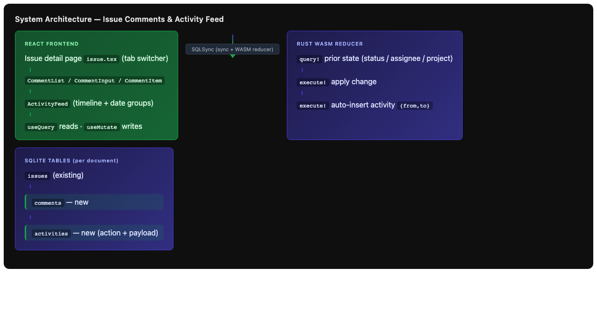
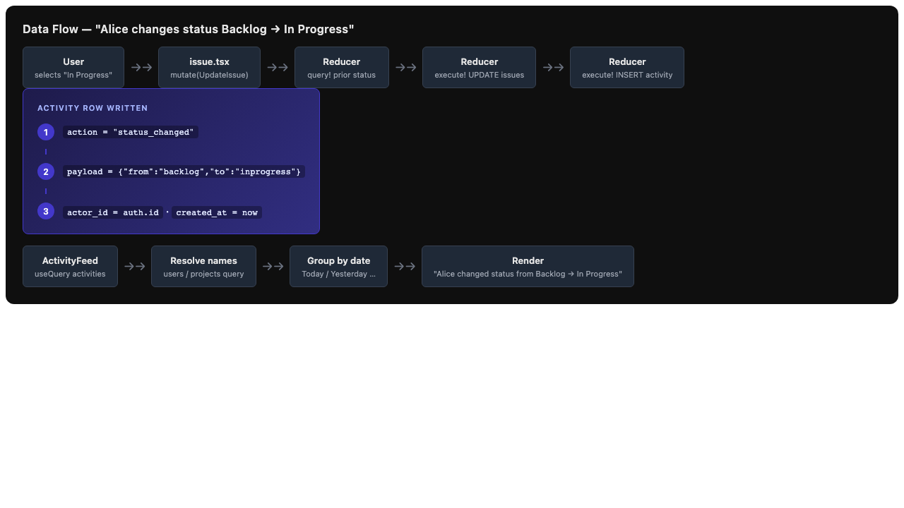
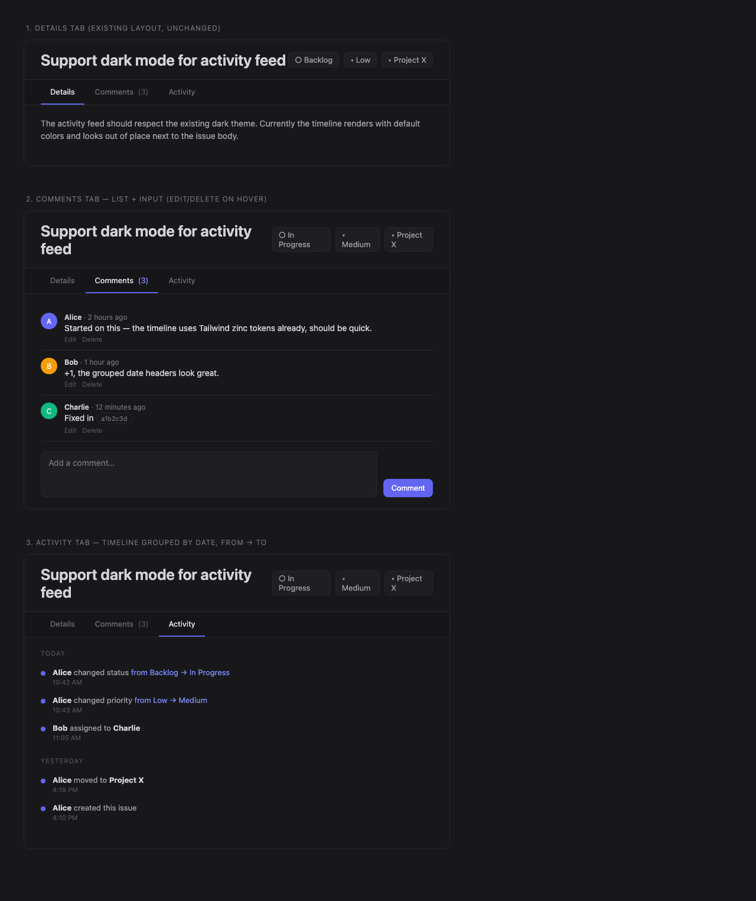

# Issue #4 — Issue Comments & Activity Feed

> **Status:** Planning (fresh implementation from `origin/main`)
> **Branch:** `fix/issue-4-redo` (worktree `tmp_worktree/issue-4-redo`)
> **Base:** `origin/main` @ `7a350a9`

## 1. Issue Summary

Add the ability to **comment on issues** and see an **activity timeline** of
changes. The feature spans the Rust WASM reducer (`reducer/src/lib.rs`) and the
React frontend, structured as 6 tasks with a dependency graph:

- Tasks 1 & 2 (Rust reducer) → parallel
- Tasks 3 & 4 (React UI) → parallel once 1 & 2 land
- Task 5 (integration) → depends on 3 & 4
- Task 6 (TS types) → depends on 1 & 2

**Acceptance criteria**

- [ ] Users can add, edit, and delete comments on any issue
- [ ] Comments appear in real-time across synced clients (SQLSync)
- [ ] Activity feed shows status changes, assignments, and moves automatically
- [ ] Comments and activities are sorted chronologically
- [ ] The UI matches the existing dark theme
- [ ] All new code is TypeScript-typed correctly

## 2. Why a Fresh Implementation

Prior attempts (branches `fix/issue-4`, `fix/issue-4-implementation`,
`fix/issue-4-test-fixes`, open PR #10) landed an implementation, but with
shortcomings that this redo resolves:

- The reducer **could not show "from → to"** in activity text because it never
  read prior state — it logged only the new value and used `""` as the actor for
  `UpdateIssue`. The activity feed therefore could not render
  *"Alice changed status from Backlog → In Progress"*.
- Activities used a `details` column instead of the spec's `payload` column.

This plan starts from a clean `origin/main` (which does **not** contain the
feature) and reimplements correctly, using the reducer's `query!` API to read
prior state.

## 3. Design Analysis (reducer API findings)

Investigation of `sqlsync-reducer 0.3.2` confirms the reducer is **not**
write-only — it exposes two macros:

| Macro | Returns | Use |
|-------|---------|-----|
| `execute!(sql, …params)` | `Result<ExecResponse { changes }>` | INSERT / UPDATE / DELETE |
| `query!(sql, …params)` | `Result<QueryResponse { columns, rows: Vec<Row> }>` | SELECT prior state |

`Row` is `Vec<SqliteValue>` where `SqliteValue = Null \| Integer \| Real \| Text \| Blob`.

**Consequence:** the reducer *can* `query!` the current status / assignee /
project before applying a change, then insert an activity row whose `payload`
(JSON) records both the old and new values — enabling true
*"from Backlog → In Progress"* text, fully reducer-side, satisfying the spec's
"hook into existing mutations to auto-insert activity rows."

**Actor:** the existing `UpdateIssue` / `AssignIssue` / `MoveIssues` mutations
carry no actor, yet the activity table needs `actor_id` and the friendly text
needs a name (*"Alice changed…"*). This plan therefore adds an `actor_id`
field to those three mutations (Rust + TS) and updates the call sites to pass the
current user's id from `useAuth()`. This is a deliberate, justified extension of
Task 2's hook requirement; it is called out explicitly because the issue's Task 6
only lists *new* variants.

## 4. Proposed Solution

### Task 1 — Comments schema & mutations (`reducer/src/lib.rs`)

Add to `InitSchema`:
```sql
create table if not exists comments (
    id text primary key,
    issue_id text not null,
    author_id text not null,
    body text not null,
    created_at text not null,
    updated_at text not null,
    foreign key (issue_id) references issues(id),
    foreign key (author_id) references users(id)
)
```

New mutation variants:
- `AddComment { id, issue_id, author_id, body }` → INSERT with `created_at = updated_at = datetime('now')`
- `EditComment { id, body }` → UPDATE `body, updated_at = datetime('now')`
- `DeleteComment { id }` → DELETE row

### Task 2 — Activities schema & mutations (`reducer/src/lib.rs`)

Add to `InitSchema`:
```sql
create table if not exists activities (
    id text primary key,
    issue_id text not null,
    actor_id text not null,
    action text not null,
    payload text,
    created_at text not null,
    foreign key (issue_id) references issues(id)
)
```

New mutation variant:
- `LogActivity { id, issue_id, actor_id, action, payload }` → INSERT (client-supplied id, e.g. uuid)

**Hook into existing mutations** (add `actor_id` to each):
- `UpdateIssue { id, status, priority, actor_id }` — `query!` prior `status`/`priority`; apply UPDATE; for each changed field insert an activity with `action` ∈ `{status_changed, priority_changed}` and `payload = JSON {from, to}`.
- `AssignIssue { id, to, actor_id }` — `query!` prior `assigned_to`; apply UPDATE; insert activity `action=assigned`, `payload={from, to}`.
- `MoveIssues { ids, project_id, actor_id }` — for each id, `query!` prior `project_id`; apply UPDATE; insert activity `action=moved`, `payload={from, to}`.

Auto-inserted activity ids use `lower(hex(randomblob(16)))` (SQLite-side unique
id) so rapid successive changes never collide on the primary key. `payload` is
built with `serde_json::json!({"from": old, "to": new}).to_string()`.

### Task 3 — Comment UI components (`app/routes/issues/components/comments/`)

- `CommentList.tsx` — `useQuery` comments for the issue (`order by created_at asc`); renders one `CommentItem` per row; takes `issue_id`.
- `CommentInput.tsx` — textarea + submit; on submit calls `mutate({ tag:"AddComment", id: uuid(), issue_id, author_id, body })` where `author_id` comes from `useAuth().auth?.id`. Clears on success. Disabled while empty.
- `CommentItem.tsx` — author name (resolved from a users query), relative timestamp, body; inline edit (textarea → `EditComment`) and delete (`DeleteComment`) with confirm.

### Task 4 — Activity feed (`app/routes/issues/components/activity/`)

- `ActivityFeed.tsx` — `useQuery` activities for the issue (`order by created_at desc`); renders a timeline grouped by date (`Today`, `Yesterday`, older dates) using a small date util. Friendly text per `action`:
  - `status_changed` → "{actor} changed status from {from} → {to}"
  - `priority_changed` → "{actor} changed priority from {from} → {to}"
  - `assigned` → "{actor} assigned to {to}" (or "unassigned" if `to` is null)
  - `moved` → "{actor} moved to {to}" (project name; "removed from project" if null)
  - `commented` (if used) → "{actor} commented"
  - Actor / assignee ids resolved to names via `useQuery` on `users`; project ids via `useQuery` on `projects`.

### Task 5 — Integrate into Issue detail page

- `app/routes/issues/components/issue.tsx` — add a tab switcher (`useState`): **Details** | **Comments (n)** | **Activity**. Details = existing issue controls + body. Comments = `CommentList` + `CommentInput` (passing `issue_id = props.issue.id`). Activity = `ActivityFeed`. Comment count badge via `useQuery` count.
- `app/routes/issues/id.tsx` — no structural change needed (already passes the issue with `id`); ensure the issue row includes `id`.

### Task 6 — TypeScript types (`app/doctype.ts`)

- Extend the `Mutation` union: `AddComment`, `EditComment`, `DeleteComment`, `LogActivity`.
- Add `actor_id: string` to `UpdateIssue`, `AssignIssue`, `MoveIssues`.
- Add types:
  ```ts
  export type Comment = { id: string; issue_id: string; author_id: string; body: string; created_at: string; updated_at: string };
  export type Activity = { id: string; issue_id: string; actor_id: string; action: string; payload: string | null; created_at: string };
  ```

## 5. Files to Modify

| File | Change |
|------|--------|
| `reducer/src/lib.rs` | comments + activities tables; new mutation variants; `query!`-based activity hooks; `#[cfg(test)]` mocks for `query!`/`execute!` + unit tests |
| `app/doctype.ts` | new `Mutation` variants; `actor_id` on 3 mutations; `Comment`/`Activity` types |
| `app/routes/issues/components/issue.tsx` | tab switcher; render Comments + Activity; pass `issue_id` |
| `app/routes/issues/components/list.tsx` | pass `actor_id` to `MoveIssues` calls (3 sites) |
| `app/routes/issues/id.tsx` | ensure issue row includes `id` (already does) |
| `package.json` | add `test`, `test:watch`, `typecheck` scripts + vitest/testing-library/jsdom devDeps |

## 6. New Files

- `app/routes/issues/components/comments/CommentList.tsx`
- `app/routes/issues/components/comments/CommentInput.tsx`
- `app/routes/issues/components/comments/CommentItem.tsx`
- `app/routes/issues/components/activity/ActivityFeed.tsx`
- `app/lib/date.ts` — date grouping helpers (`group by date`, `Today/Yesterday/absolute`)
- `vitest.config.ts`
- `tests/setup.ts`
- `tests/comment-components.test.tsx`
- `tests/activity-feed.test.tsx`
- `tests/date-utils.test.ts`
- `tests/issue-tabs.test.tsx`
- `tests/doctype.test.ts`
- `reducer` Rust unit tests live inside `reducer/src/lib.rs` (`#[cfg(test)] mod tests`)

## 7. Test Strategy (TDD)

**Order:** write failing tests → commit → implement → green.

**Rust reducer** (`cargo test`, mocked `query!`/`execute!`):
- `Mutation` variants deserialize from JSON with the right `tag` (type alignment, Task 6).
- `AddComment` / `EditComment` / `DeleteComment` emit the expected INSERT/UPDATE/DELETE SQL.
- `UpdateIssue` emits a `select` (prior state) then an `update issues` then an `insert into activities` whose captured params include a `status_changed` payload with `from`/`to`.
- `AssignIssue` and `MoveIssues` likewise emit activity inserts with `{from, to}` payloads.
- `LogActivity` emits an INSERT using the client-supplied id.
- `npm run build:reducer` (wasm32) confirms the reducer compiles for the real target.

**TypeScript / React** (Vitest + jsdom + @testing-library/react; mocks of `useQuery`/`useMutate` via `~/context/document.context` and `useAuth`):
- `tests/doctype.test.ts` — `Mutation` variant objects carry the correct `tag` and required fields; `Comment`/`Activity` types are satisfied by sample rows.
- `tests/comment-components.test.tsx` — `CommentInput` calls `mutate` with `AddComment` on submit and clears; `CommentList` renders rows sorted; `CommentItem` edit/delete call `EditComment`/`DeleteComment`.
- `tests/activity-feed.test.tsx` — renders friendly text per action; resolves actor/assignee/project names; groups by date.
- `tests/date-utils.test.ts` — `Today`/`Yesterday`/absolute-date grouping; chronological sort; timezone-stable.
- `tests/issue-tabs.test.tsx` — tab switcher shows the right panel; comment-count badge reflects query; `issue_id` is passed through.

**Build / type check:** `npm run build`, `tsc --noEmit` (new `typecheck` script), `npm run build:reducer`.

**Adversarial / manual (Phase 5.6):** rapid double-submit, empty/huge comment bodies, edit-then-delete race, switching tabs mid-action, missing actor (`auth` null), activities with null `payload`/`to`.

## 8. Risks

- **`query!` ordering in tests:** the mock returns canned rows in LIFO order; tests must push expected query results in the correct sequence. Mitigated by keeping each test single-purpose.
- **`actor_id` is a breaking mutation-shape change:** any caller not updated will fail TypeScript / runtime. Mitigated by a grep-verified audit of all `UpdateIssue`/`AssignIssue`/`MoveIssues` call sites (issue.tsx ×3, list.tsx ×3) and the server `mutate` helper.
- **WASM host-symbols:** the prior `fix(build)` commit (af96f00) added a linker config for undefined host symbols; that config is **not** on `origin/main`, so `build:reducer` against the clean base may need the same `reducer/.cargo/config.toml` allowance. Will re-add if the build fails.
- **Real-time sync (SQLSync):** unit tests mock the hooks; live multi-client sync is validated in the adversarial/manual phase, not automated.
- **`VITE_BASE_URL` runtime:** `app/lib/sqlsync.tsx` calls `import.meta.env.VITE_BASE_URL.replace(...)` unguarded; `.env` has it set, but the dev server must be launched with the env loaded. (Out of scope to harden, but noted.)

## 9. Diagrams

Architecture, data-flow, and a UI mockup are generated alongside this plan (see
images below) and committed to this plans repo.






