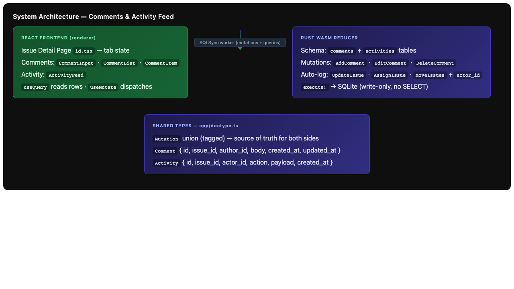
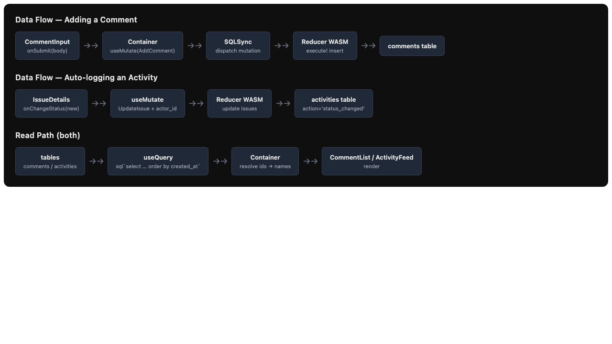
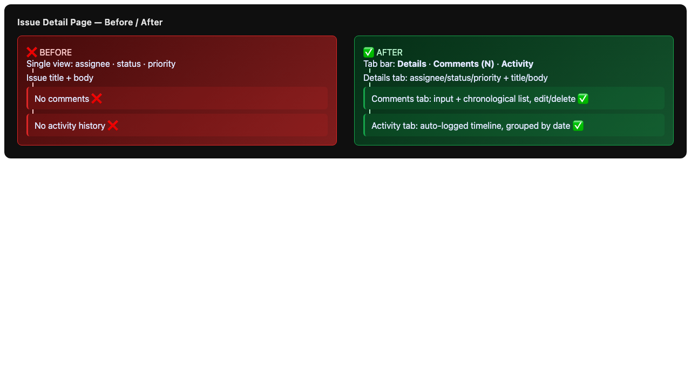
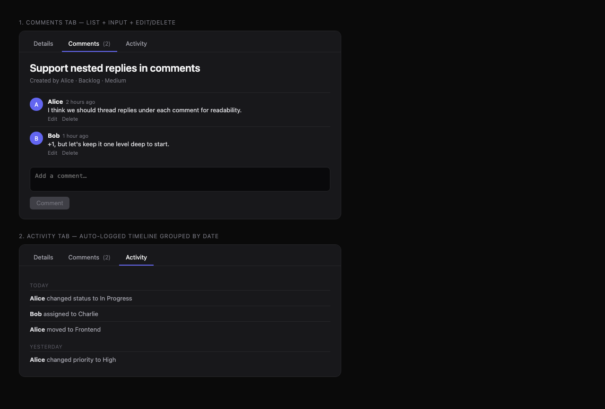

# Issue #4 — Issue Comments & Activity Feed

> **Status:** Fresh re-implementation (supersedes prior attempts on `fix/issue-4-*` branches and PR #10).
> **Base:** `origin/main` (`7a350a9`) — clean, no prior feature commits.
> **Worktree branch:** `fix/issue-4-redo`

---

## 1. Issue Summary

Add the ability to **comment on issues** and see an **activity timeline** of changes. The
feature spans the Rust WASM reducer (schema + mutations) and the React frontend (UI
components + integration), plus shared TypeScript types.

**Acceptance criteria (from the issue):**

- [ ] Users can add, edit, and delete comments on any issue
- [ ] Comments appear in real-time across synced clients (SQLSync)
- [ ] Activity feed shows status changes, assignments, and moves automatically
- [ ] Comments and activities are sorted chronologically
- [ ] The UI matches the existing dark theme
- [ ] All new code is TypeScript-typed correctly

---

## 2. Context — Why a Fresh Start

Prior attempts left four local branches and an open PR #10. Review of the most advanced
prior branch (`fix/issue-4-test-fixes`) revealed **correctness flaws in the reducer** that
motivated starting over from a clean `origin/main`:

1. **Empty / wrong actor for activities.** The reducer logged `actor_id = ''` (empty string)
   for status, priority, archive, restore, and move activities. For assignments it used the
   *assignee* as the actor. The activity feed therefore could not attribute changes to a user.
2. **Activity ID collisions.** Activity IDs were derived as `"{issue_id}_status"`,
   `"{issue_id}_assign"`, etc. Repeating the same operation on the same issue collides on the
   `PRIMARY KEY` and the second insert fails silently.
3. **Spec drift.** The prior `Comment` type used `created_by` and omitted `updated_at`; the
   activity table used a `details` column instead of the specified `payload`.
4. **SQL safety.** Activity inserts used `format!`-interpolated strings (SQL-injection-shaped)
   purely so tests could read values back.

This plan addresses all four.

---

## 3. Architectural Constraint (Important)

**SQLSync reducers are write-only.** A reducer receives a mutation and emits SQL
`execute!` statements; it **cannot `SELECT` existing state** (state is rebuilt by replaying
mutations). Consequences for this feature:

- The reducer **cannot know the "old" value** of a status/priority/assignment/project when
  logging an activity. Therefore activity records store the **new** value, and the
  `ActivityFeed` renders e.g. *"Alice changed status to In Progress"* rather than
  *"from Backlog → In Progress"*.
- The activity `payload` stores **ids** (assignee id, project id). The `ActivityFeed`
  resolves ids → names by joining with the `users` and `projects` queries in the UI.
- The reducer **cannot generate a UUID** (no `uuid` crate dependency, and adding one
  increases WASM size). Activity IDs are generated in SQL via
  `lower(hex(randomblob(16)))` — unique per insert, no collision risk.

This is a deliberate, honest scope decision. "From X → Y" descriptions would require the
frontend to pass prior values into the mutation; that is documented as a future enhancement,
not part of this fix.

---

## 4. Proposed Solution

### 4.0 Prerequisite — wasm32 build fix (already committed `51d25d5`)

`origin/main` cannot build the reducer for `wasm32` — `cargo build --target
wasm32-unknown-unknown --release` fails with `undefined symbol: host_log` because
`sqlsync-reducer` declares extern host functions that the runtime provides. The fix
(commit `af96f00` on local `main`, absent from `origin/main`) adds a linker config
and is re-applied here as the first commit:

- **New file `reducer/.cargo/config.toml`:**
  ```toml
  [target.wasm32-unknown-unknown]
  rustflags = ["-C", "link-arg=--allow-undefined"]
  ```
- `.gitignore`: add `.env.local`.

Verified: the reducer now builds for `wasm32` on the fresh branch.

### 4.1 Reducer — `reducer/src/lib.rs` (Tasks 1, 2, 6-partial)

**Schema (added to `InitSchema`):**

```sql
create table if not exists comments (
    id text primary key,
    issue_id text not null,
    author_id text not null,
    body text not null,
    created_at text not null,
    updated_at text not null,
    foreign key (issue_id) references issues(id),
    foreign key (author_id) references users(id)
)

create table if not exists activities (
    id text primary key,
    issue_id text not null,
    actor_id text not null,
    action text not null,
    payload text,
    created_at text not null,
    foreign key (issue_id) references issues(id)
)
```

Column names match the issue spec exactly (`author_id`, `payload`).

**New mutations:**

- `AddComment { id, issue_id, author_id, body }` → insert comment (`created_at = updated_at = datetime('now')`).
- `EditComment { id, body }` → update `body` and `updated_at = datetime('now')` for the row.
- `DeleteComment { id }` → delete the row.
- `LogActivity { id, issue_id, actor_id, action, payload }` → insert activity (used by the UI
  for explicit logging if ever needed; also the shape used by auto-logging internally).

**Auto-logging (hook into existing mutations):**

Add an **optional** `actor_id: Option<String>` to `UpdateIssue`, `AssignIssue`, and
`MoveIssues`. When `actor_id` is `Some`, the reducer inserts an activity row **after** the
update, using parameterized SQL with a safe inline `action` literal:

```sql
insert into activities (id, issue_id, actor_id, action, payload, created_at)
values (lower(hex(randomblob(16))), ?, ?, 'status_changed', ?, datetime('now'))
```

| Mutation arm                     | `action` literal   | `payload` content                  |
|----------------------------------|--------------------|------------------------------------|
| `UpdateIssue` (status set)       | `status_changed`   | new status string                  |
| `UpdateIssue` (priority set)     | `priority_changed` | new priority string                |
| `AssignIssue`                    | `assigned`         | new assignee id, or `null`/`"unassigned"` |
| `MoveIssues` (per issue id)      | `moved`            | new project id, or `null`/`"inbox"` |

The UI calls `UpdateIssue` twice (once for status, once for priority), so each change logs
exactly one activity. `MoveIssues` with N ids logs N activities. `ArchiveIssues` /
`RestoreIssues` are **left unchanged** (out of spec scope) to minimize blast radius.

**Why optional `actor_id`:** backward-compatible — existing call sites that omit it still
deserialize (serde treats a missing `Option<T>` as `None`) and simply skip logging. The UI
passes the current user's id from `useAuth()` at the call sites it wants attributed.

**Testability hook (`#[cfg(test)]`):** a `#[cfg(test)]` mock of the `execute!` macro records
emitted SQL into a thread-local `Vec<String>` (returning a ready `ExecResponse`). This lets
`cargo test` run the reducer natively and assert the correct SQL is emitted — real TDD on the
reducer without the full SQLSync runtime. Variable values are bound via `?` (safe); the
`action` is an inline string literal (safe + assertable). A small `block_on` helper polls the
ready futures to completion. *(If `cargo test` fails to compile due to `init_reducer!`
expansions, the fallback is build-verification (`cargo build --target wasm32`) + UI tests
only.)*

### 4.2 TypeScript Types — `app/doctype.ts` (Task 6)

Add `Comment` and `Activity` types and extend the `Mutation` union:

```typescript
export type Comment = {
  id: string;
  issue_id: string;
  author_id: string;
  body: string;
  created_at: string;
  updated_at: string;
};

export type Activity = {
  id: string;
  issue_id: string;
  actor_id: string;
  action: string;
  payload: string | null;
  created_at: string;
};
```

Add `actor_id?: string` to `UpdateIssue`, `AssignIssue`, `MoveIssues`. Add `AddComment`,
`EditComment`, `DeleteComment`, `LogActivity` variants.

### 4.3 UI Components (Tasks 3, 4) — presentational + testable

New components are **presentational**: they receive data and callbacks as props and do **not**
call `useQuery`/`useMutate` directly. This keeps them unit-testable with `@testing-library`
without mocking the SQLSync hooks. A thin container in the issue detail page wires the hooks.

- `app/routes/issues/components/comments/CommentInput.tsx` — textarea + submit button;
  props: `onSubmit(body: string)`, `disabled?`. Resets on submit. Empty body disables submit.
- `app/routes/issues/components/comments/CommentItem.tsx` — single comment with author name,
  timestamp, body, edit/delete buttons; props: `comment`, `authorName`, `canEdit`,
  `onEdit(id, body)`, `onDelete(id)`. Inline edit mode toggles textarea + Save/Cancel.
- `app/routes/issues/components/comments/CommentList.tsx` — scrollable chronological list;
  props: `comments`, `userMap: Record<string,string>`, `currentUserId`, `onAdd`,
  `onEdit`, `onDelete`. Renders `CommentInput` at top, `CommentItem`s below, empty-state when
  no comments.
- `app/routes/issues/components/activity/ActivityFeed.tsx` — chronological timeline grouped by
  date; props: `activities`, `userMap`, `projectMap`. Renders friendly text per `action`:
  - `status_changed` → "{user} changed status to {value}"
  - `priority_changed` → "{user} changed priority to {value}"
  - `assigned` → "{user} assigned to {name|Unassigned}"
  - `moved` → "{user} moved to {projectName|Inbox}"

### 4.4 Date utilities — `app/lib/date.ts`

A small, pure helper module for relative timestamps and date grouping ("Today", "Yesterday",
"MMM d"), used by `CommentItem` and `ActivityFeed`. Pure functions → directly unit-testable.

### 4.5 Integration (Task 5) — `app/routes/issues/id.tsx` + `components/issue.tsx`

Add a **tab switcher** to the issue detail page: **Details** | **Comments (N)** | **Activity**.

- `id.tsx` fetches the issue **and** its comments/activities via `useQuery` (sorted
  chronologically), and fetches users + projects for name resolution. It holds the active tab
  state and renders the tab bar + the corresponding panel.
- The `Comments` container wires `useMutate` to dispatch `AddComment` / `EditComment` /
  `DeleteComment` (generating `id` via `uuid`), passing data + callbacks into `CommentList`.
- `issue.tsx`'s existing `onChangeStatus` / `onChangeAssignee` / `onChangePriority` /
  `MoveIssues` call sites pass `actor_id: auth?.id` so the reducer auto-logs activity.
- `issue_id` is passed to comment/activity containers (required by the spec).

### 4.6 Test infrastructure (foundational — base has none)

The clean `origin/main` has **no test runner**. Add:

- **`vitest`** + `@testing-library/react` + `@testing-library/jest-dom` + `@testing-library/user-event` + `jsdom` as devDependencies.
- **`vitest.config.ts`** (jsdom env, globals, `~` → `./app` alias, setup file).
- **`tests/setup.ts`** (`import "@testing-library/jest-dom/vitest"`).
- **`package.json` scripts:** `"test": "vitest run"`, `"test:watch": "vitest"`,
  `"typecheck": "tsc --noEmit"`.

---

## 5. Files to Modify

| File | Change |
|---|---|
| `reducer/src/lib.rs` | Add `comments` + `activities` schema; add `AddComment`/`EditComment`/`DeleteComment`/`LogActivity` mutations; add optional `actor_id` to `UpdateIssue`/`AssignIssue`/`MoveIssues`; auto-log activities; add `#[cfg(test)]` SQL-mock + unit tests. |
| `app/doctype.ts` | Add `Comment`, `Activity` types; add 4 mutation variants; add `actor_id?` to 3 variants. |
| `app/routes/issues/id.tsx` | Fetch comments/activities/users/projects; tab state; render tab bar + panels. |
| `app/routes/issues/components/issue.tsx` | Pass `actor_id: auth?.id` to `UpdateIssue`/`AssignIssue`/`MoveIssues` call sites; expose `issue_id` to children. |
| `app/routes/issues/components/list.tsx` | Pass `actor_id: auth?.id` to bulk `MoveIssues` call sites (so moves log activity). |
| `package.json` | Add `test`, `test:watch`, `typecheck` scripts + test devDependencies. |
| `vitest.config.ts` *(new)* | Vitest config. |
| `tests/setup.ts` *(new)* | jest-dom setup. |

## 6. New Files

- `reducer/.cargo/config.toml` *(prerequisite build fix)*
- `app/routes/issues/components/comments/CommentInput.tsx`
- `app/routes/issues/components/comments/CommentItem.tsx`
- `app/routes/issues/components/comments/CommentList.tsx`
- `app/routes/issues/components/activity/ActivityFeed.tsx`
- `app/lib/date.ts`
- `tests/comment-components.test.tsx`
- `tests/activity-feed.test.tsx`
- `tests/date-utils.test.ts`
- `tests/issue-tabs.test.tsx`
- `vitest.config.ts`, `tests/setup.ts`

---

## 7. Test Strategy (TDD)

**Phase 3 — tests first (expected to fail), then implement.**

1. **Reducer (`cargo test`):** assert `InitSchema` creates `comments` + `activities` with
   correct columns/FKs; assert `AddComment`/`EditComment`/`DeleteComment` emit correct
   parameterized SQL; assert `UpdateIssue`/`AssignIssue`/`MoveIssues` emit an
   `insert into activities` with the correct `action` literal when `actor_id` is set, and
   emit **no** activity when `actor_id` is `None`.
2. **Date utils (`vitest`):** relative-time and date-grouping pure functions.
3. **Components (`vitest` + `@testing-library`):** render with props, assert:
   - `CommentInput` disables submit on empty body, calls `onSubmit` with body, resets.
   - `CommentItem` shows author/timestamp/body, edit mode saves/cancels, delete calls handler.
   - `CommentList` renders all comments, empty state, passes user names + callbacks through.
   - `ActivityFeed` renders friendly text per action, resolves ids → names, groups by date.
   - Tabs: Details/Comments/Activity switching shows the right panel; Comments tab shows count.
4. **Verify:** `npm test` (vitest) + `cargo test` (reducer) + `cargo build --target wasm32`
   (reducer compiles) + `npm run build` (app compiles). Manual smoke of the dev server for the
   real-time sync criterion.

## 8. Risks

- **`cargo test` on a `cdylib`:** the `init_reducer!` macro may expand to WASM-host bindings
  that don't compile natively. *Mitigation:* the `#[cfg(test)]` mock replaces `execute!`; if
  compilation still fails, fall back to build-verification + UI tests only (reducer SQL is
  simple and reviewed).
- **`MoveIssues` bulk activity volume:** moving N issues logs N activity rows. Acceptable;
  activities are chronological and the feed paginates/groups by date.
- **Real-time sync:** depends on the SQLSync coordinator running. The `.env` sets
  `VITE_BASE_URL=http://localhost:8080`; E2E verification of sync requires the coordinator
  service (may be unavailable locally — flag as "manual" if so).
- **`actor_id` optionality:** if a call site forgets to pass it, that change silently logs no
  activity. *Mitigation:* the reducer test "no activity when actor_id is None" documents the
  contract; the issue-detail call sites (the primary UX) always pass it.

---

## Diagrams








