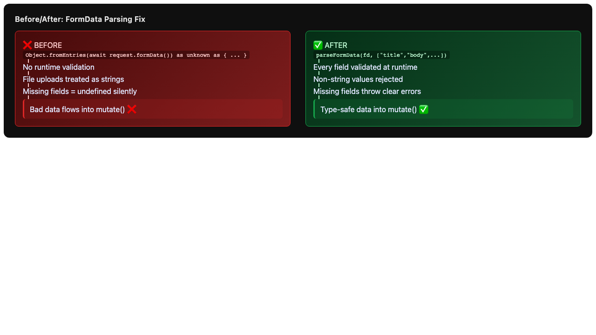

# Issue #5 – Fix Type-Erasing Casts on `formData()`

## Issue Summary

Five route action handlers parse `FormData` using `Object.fromEntries()` followed by type-erasing casts (`as unknown as { ... }` or `as { ... }`). `FormData` values are `string | File` at runtime — the casts provide zero validation and hide real type mismatches. If a `File` is uploaded or a field is missing, the code silently propagates bad data into mutations.

## Affected Files

| File | Line | Current Pattern |
|------|------|----------------|
| `app/routes/issues/new.tsx` | 10 | `as unknown as { ... }` |
| `app/routes/assigned/new.tsx` | 11 | `as unknown as { ... }` |
| `app/routes/projects/id.new.tsx` | 10 | `as unknown as { ... }` |
| `app/routes/teams/projects/new.tsx` | 21 | `as { ... }` |
| `app/routes/projects/new.tsx` | 17 | `as { ... }` |

## Root Cause Analysis

1. **No shared utility exists**: Each route independently re-implements the same `Object.fromEntries()` + cast pattern.
2. **Inconsistent casting styles**: Three routes use `as unknown as`, two use `as` directly — showing organic copy-paste without standards.
3. **No runtime validation**: `FormData.get()` returns `FormDataEntryValue | null` (i.e. `string | File | null`). The cast pretends these are always strings.
4. **Silent failures**: If a field is missing, `Object.fromEntries()` simply omits it, and the cast produces `undefined` — which may or may not be handled downstream.

## Proposed Solution

### 1. Create Shared Helper

Create `app/lib/form.ts` with a `parseFormData` utility:

```ts
export function parseFormData<T extends Record<string, string>>(
  fd: FormData,
  keys: (keyof T)[]
): T {
  const result = {} as T;
  for (const key of keys) {
    const value = fd.get(key as string);
    if (value === null) throw new Error(`Missing field: ${String(key)}`);
    if (typeof value !== "string") throw new Error(`Field ${String(key)} must be a string`);
    result[key] = value as T[keyof T];
  }
  return result;
}
```

### 2. Update All Affected Routes

Replace each `Object.fromEntries(await request.formData()) as ...` with `parseFormData(await request.formData(), [...])`:

- `issues/new.tsx` → validate `title`, `body`, `project_id`, `assigned_to`, `status`, `priority`, `team`
- `assigned/new.tsx` → validate same fields as above
- `projects/id.new.tsx` → validate same fields as above
- `teams/projects/new.tsx` → validate `name`, `team`
- `projects/new.tsx` → validate `name`, `team` (while preserving existing `undefined` checks for backwards-compatible error handling)

### 3. Bonus Fix

`app/routes/teams/projects/new.tsx` has a duplicate `TeamIcon` import (lines 12 and 18). Remove the duplicate.

## Files to Modify

1. **`app/lib/form.ts`** — new shared helper
2. **`app/routes/issues/new.tsx`** — use `parseFormData`
3. **`app/routes/assigned/new.tsx`** — use `parseFormData`
4. **`app/routes/projects/id.new.tsx`** — use `parseFormData`
5. **`app/routes/teams/projects/new.tsx`** — use `parseFormData`, remove duplicate import
6. **`app/routes/projects/new.tsx`** — use `parseFormData`

## Test Strategy

The project currently has no JavaScript/TypeScript test runner configured. We will:

1. **Add Vitest** as a dev dependency (lightweight, Vite-native).
2. **Write unit tests** for `parseFormData` covering:
   - Happy path: all fields present and are strings
   - Missing field: throws descriptive error
   - File upload: throws descriptive error
   - Empty string: allowed (valid form value)
3. **Run tests** to verify they pass after implementation.

## Risks

| Risk | Mitigation |
|------|-----------|
| `parseFormData` throws where old code silently produced `undefined` | This is desired behavior — it surfaces bugs instead of hiding them |
| Routes with optional fields (`project_id?`) | Pass optional keys only when present; handle `null` with `??` as before |
| `teams/projects/new.tsx` duplicate import removal | Straightforward; verified by TypeScript compiler |

## Diagram


